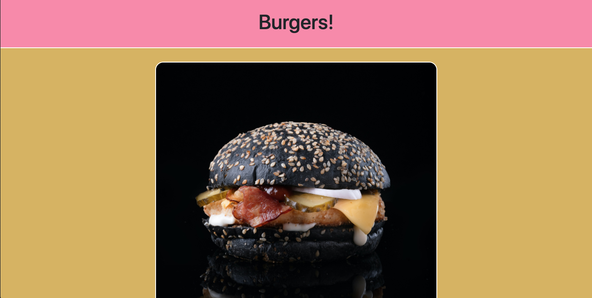

# Burger


**_Links_**

Deployed URL: http://kp-burger.herokuapp.com/

Github Code URL: https://github.com/kpegeder/burger

## Description

The application is a MVC design pattern to create a burger logger. It allows the user to create, move and delete an burger without having to leave the page. The burgers are stored in a database on Heroku or locally.

## Table of Contents

- [Installation](#installation)
- [Usage](#usage)
- [Test](#test)
- [License](#license)
- [Questions](#questions)

## Installation

To install necessary dependencies, run the following command:

```
npm install
```

## Usage

Instructions to use the program are shown below

1. Use the Add Burger button top populate the section of Burgers to EAT
2. Click the EAT DA BURGER to move the burget to the Burgers EATEN
3. Click EAT ANOTHER BURGER to move a burger back to to Burgers to Eat
4. Click the X to delete a burger




## Test

To run tests, run the following command:

```
npm test
```

## Contributing

[Kalen Pegeder](https://github.com/kpegeder)

## License

Licensed under the MIT license.

## Questions

If you have any additional questions about the applictaion, you can contact through [email](mailto:k.pegeder@gmail.com).
You can see more of my work on [GitHub](https://github.com/kpegeder).
